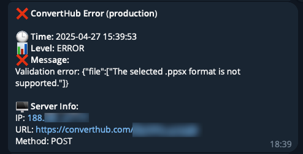

# Laravel Telegram Logger

**TelegramLogger** is a simple notification logger for Laravel that sends application errors directly to your Telegram chat or group via a bot.

This allows you to monitor your Laravel app's errors instantly through Telegram, helping you react faster to issues.

## Features

- 📬 Send Laravel errors directly to Telegram
- ⚡ Instant notifications
- 🔒 Safe and secure, no third-party services needed
- 🛠️ Easy to integrate with existing Laravel apps

## Installation

1. **Place the Logger file**  
   Copy the `TelegramLogger.php` file into your `app/Notifications/` directory.


2. **Update `config/logging.php`**  
   Add a new logging channel named `telegram`:

   ```php
   'channels' => [
       // ... other channels
       'telegram' => [
           'driver' => 'monolog',
           'level' => 'error',
           'handler' => App\Notifications\TelegramLogger::class,
       ],
   ],
    ```
   By default, this logger only sends errors (level => 'error').
   
   You can change the level value inside config/logging.php depending on what you want to receive


3. **Update config/services.php**
    
    Add the Telegram bot token and chat ID configuration:
    ```php
    'telegram' => [
        'error_bot_token' => env('TELEGRAM_BOT_TOKEN'),
        'error_chat_id' => env('TELEGRAM_CHAT_ID'),
    ],
    ```
4.	**Update your .env file**

    Add the following environment variables:
    ```env
    TELEGRAM_BOT_TOKEN=your_bot_token
    TELEGRAM_CHAT_ID=your_chat_id
    ``` 
Replace the placeholders with your actual bot token and chat/group ID.

5. **Enable the Telegram channel in your log stack**
    
    Modify the .env setting:
    ```env
    LOG_CHANNEL=stack
    LOG_STACK=single,telegram
    ```
Make sure LOG_CHANNEL is set to stack and add telegram to your LOG_STACK.

## Requirements

- Laravel 8 or higher
- A Telegram Bot Token (Create one using [BotFather](https://t.me/botfather))
- A Telegram Chat ID or Group ID

## How it works

- When an error (or higher level) occurs, Laravel will trigger the telegram logging channel.
- The TelegramLogger formats and sends the error message directly to your Telegram chat using the Telegram Bot API.

## Example Error Notification

When an error happens, you will receive a message like this in your Telegram:



## Troubleshooting

**Nothing is being sent:**
   - Double-check your bot token and chat ID.
   - Make sure your bot has permission to send messages to the chat/group.
   - Confirm that the appropriate log level is triggered (e.g., error, info).

**Message not delivered:**
   - Validate that your bot is not restricted.
   - Check if the error message format is causing API rejections (special characters, etc.).

## License

This project is open-sourced under the [MIT License](https://opensource.org/licenses/MIT).

---
Created with ❤️ by [Venelin K.](https://github.com/venelinkochev)